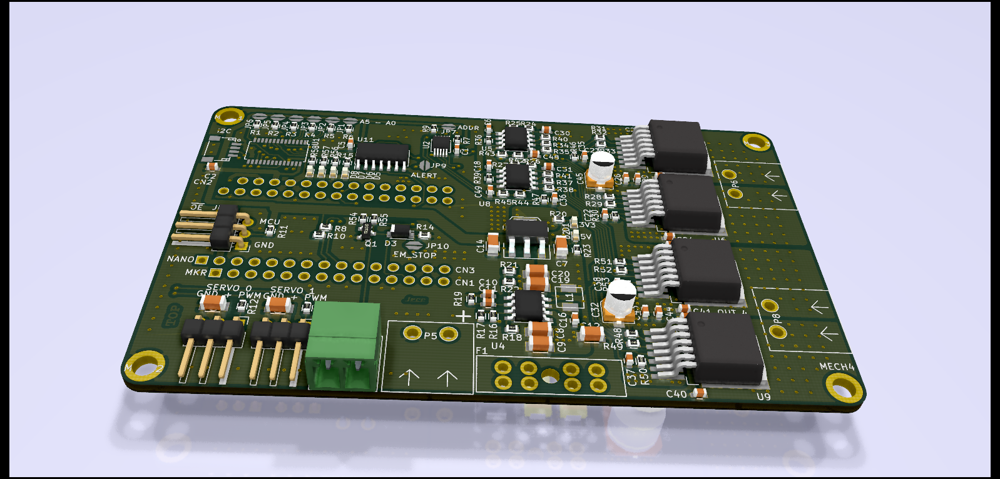
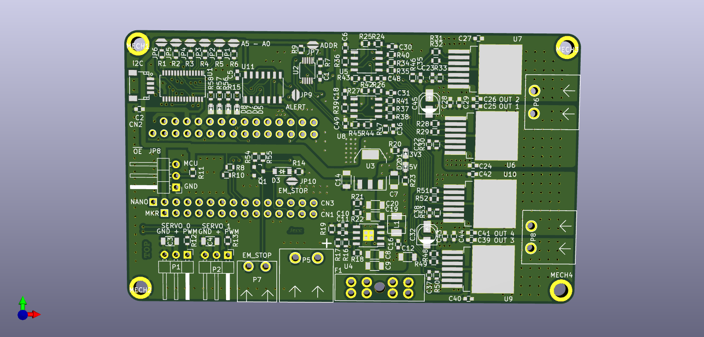
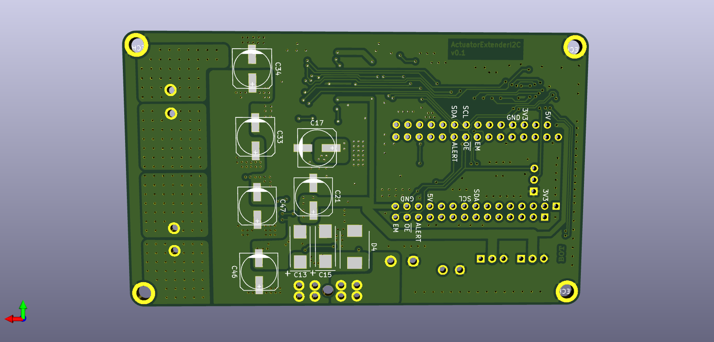

# ActuatorExtenderI2C
Control two DC motors and two Servos via I2C ( using an Arduino MKR )

## Features
* Connection header for Arduino MKR
* Qwiic connector
* Powertrain for two DC motors with back emf measurement, current sense, and emergency stop
* Connectors for 2 servo motors at 5V
* Car fuse
* Address selection jumpers

## Top Layer

## Bottom Layer

## References

